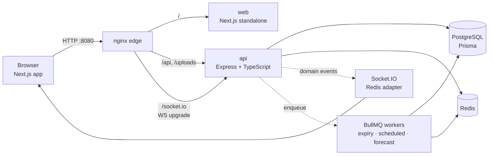
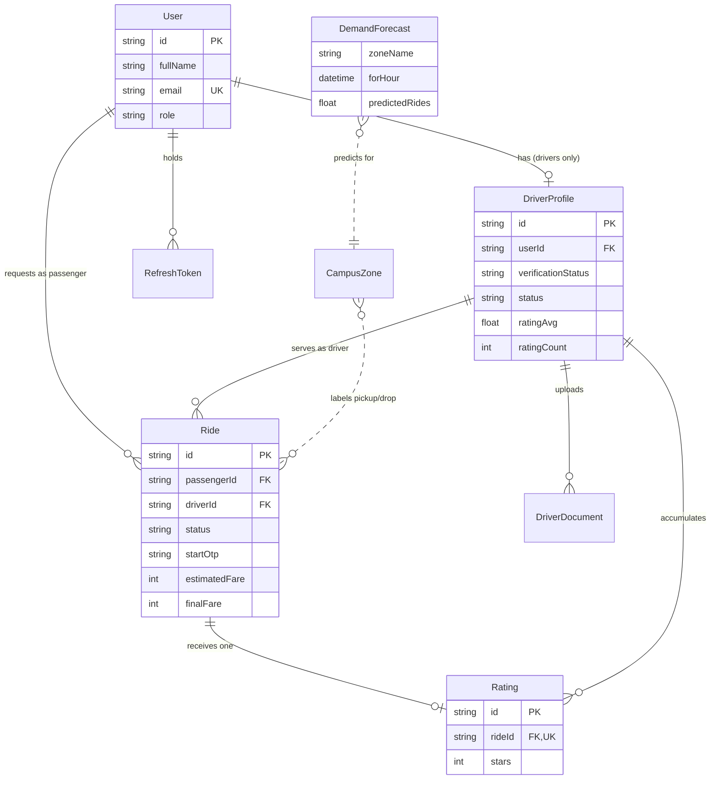
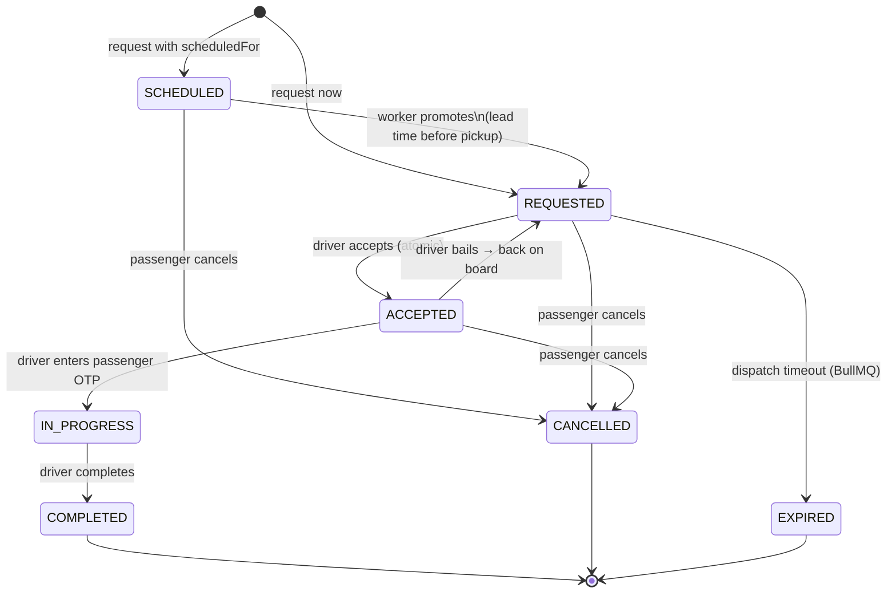
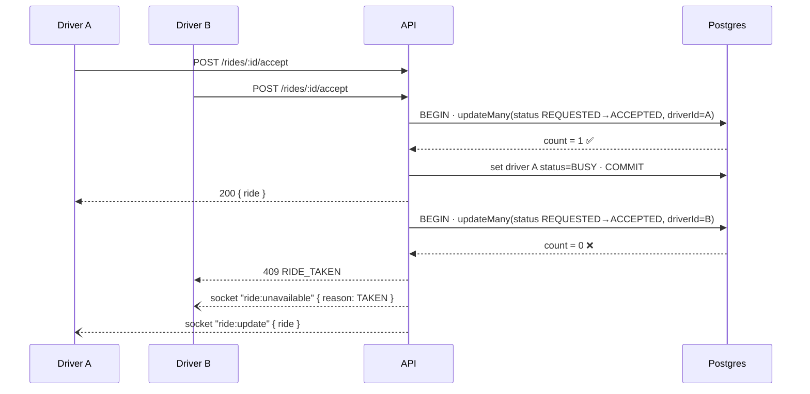

# Architecture

Smart Campus Mobility is a real-time ride dispatch platform sized for a single campus: passengers request e-rickshaw/auto/shuttle rides between named campus zones, verified drivers accept them from a live board, and an operations team watches everything move. The design optimizes for three things, in order: **correctness under concurrency** (two drivers tapping *Accept* at the same instant must never both win), **real-time first** (every state change is pushed, never polled), and **demo-friendliness** (one `docker compose up` produces a fully seeded, explorable system).

## System topology



Everything the browser touches goes through one nginx origin (`:8080`), which keeps cookies first-party and removes CORS from the happy path. The API container exposes `:4000` directly as well, purely as a convenience for curl/Postman exploration.

A single Express process hosts the REST API, the Socket.IO server, and the BullMQ workers. That is the right shape at campus scale; the seams for splitting it later are already in place (see *Scaling* in `DEPLOYMENT.md`) because sockets ride on the Redis adapter and workers communicate only through the queue and the database.

## Domain model



Two deliberate choices here. First, `Ride.driverId` references **`DriverProfile.id`, not `User.id`** — rides are served by a vehicle-bearing profile, and every aggregate a driver cares about (earnings, rating roll-ups, totals) hangs off the profile. The API serializer always nests the human fields (`driver.user.fullName`, `driver.user.phone`) so clients never need a second lookup. Second, ratings are denormalized onto the profile (`ratingAvg`, `ratingCount`) inside the same transaction that inserts the `Rating` row, so the dispatch board can sort and display reputations without aggregate queries.

## The ride state machine



The machine lives in one file (`src/modules/rides/rides.machine.ts`) as a `TRANSITIONS` table plus `assertTransition`, and it is enforced twice: once in application code for readable errors, and once **structurally in the database write**. Every status change is a *guarded* `updateMany`:

```ts
const { count } = await tx.ride.updateMany({
  where: { id, status: from },   // ← the guard
  data:  { status: to, ... },
});
if (count === 0) throw new ApiError(409, ...); // someone else moved it first
```

Because the `WHERE` clause includes the expected current status, a concurrent transition makes the second writer match zero rows instead of silently overwriting. This is optimistic concurrency without version columns — the status itself is the version.

## The accept race, end to end

The sharpest concurrency edge is two drivers accepting the same request within milliseconds. The flow:



Driver B's client handles the 409 by removing the card; the broadcast `ride:unavailable` clears it from every *other* online driver's board too. No locks, no queues in the hot path — one indexed conditional write decides the winner.

## Domain events over direct coupling

Services never import the socket layer. They emit typed domain events on an in-process bus (`src/lib/bus.ts`) — `ride.requested`, `ride.updated`, `ride.unavailable`, `driver.presence`, `driver.location` — and the socket module subscribes and translates them into room broadcasts. The same events feed the queue module (e.g. `ride.requested` schedules the expiry job). This buys three things: ride logic is unit-testable without a socket server, the broadcast topology lives in exactly one file, and pushing events to an external broker later means swapping the bus implementation, not touching business code.

## Real-time topology

Connections authenticate with the same short-lived JWT as REST (sent in the Socket.IO handshake). On connect, sockets join rooms by identity and role:

| Room | Who | Receives |
|---|---|---|
| `user:{userId}` | that user's devices | `ride:update` for their rides |
| `drivers:online` | drivers toggled online | `ride:requested`, `ride:unavailable` |
| `ride:{rideId}` | ride participants who subscribed | `driver:location`, `ride:update` |
| `admins` | operations staff | everything above + `driver:presence` |

Driver GPS pings (`driver:location`, throttled client-side to ~4 s) update a **Redis GEO index** for nearby-driver queries and are persisted to Postgres at a much lower rate (the DB is the record of *roughly where*, Redis is the record of *now*). Location broadcasts go only to the ride room and admins — a passenger sees their assigned driver move, not the whole fleet. Driver disconnects start a 45-second grace timer before flipping `ONLINE → OFFLINE`, so a flaky hostel Wi-Fi blip doesn't dequeue a working driver. The Socket.IO Redis adapter is wired from the start, so adding API replicas later changes nothing about delivery.

## Background jobs

BullMQ (on the same Redis) runs three queues. `ride-expiry` fires per-request at `RIDE_DISPATCH_TIMEOUT_SEC` and moves still-`REQUESTED` rides to `EXPIRED` — the guarded write makes a late job against an accepted ride a harmless no-op. `scheduled-rides` holds one delayed job per future booking and promotes `SCHEDULED → REQUESTED` with a configurable lead, at which point the normal dispatch flow (including a fresh expiry job) takes over. `forecasts` recomputes demand predictions hourly via a repeatable scheduler. Job IDs are deterministic (`expire:{rideId}:{ts}`, `dispatch:{rideId}`) so retries and re-enqueues stay idempotent.

## Demand analytics and forecasting

Campus demand is dominated by two seasonalities — hour-of-day and day-of-week (the 8 a.m. lecture rush looks nothing like Sunday 8 a.m.). The forecaster is therefore deliberately simple: **seasonal-naive with exponential recency weighting**. For each `(zone, hourOfDay, dayOfWeek)` bucket it takes the weighted mean of the last four matching weeks, halving the weight per week of age, and writes per-zone-per-hour predictions for the next 24 hours. It trains in a single SQL pass, is fully explainable to a transport office, and at this data volume outperforms anything that needs hyperparameters. The `modelVersion` column on `DemandForecast` is the seam for swapping in gradient boosting later without a schema change. The admin *Demand* tab complements it with descriptive analytics (hour-of-day histogram, weekday profile, pickup hotspots) computed straight from ride history.

## Fares, OTP, and payments

Fares are deterministic — ₹20 base + ₹10/km over the haversine distance between zone centroids — estimated at request time and finalized at completion. Trip start requires the driver to enter a 4-digit OTP shown only on the passenger's screen, which proves physical co-presence before the state machine will move to `IN_PROGRESS`. Payments are **simulated**: UPI rides flip to `PAID` on completion and cash rides record `COLLECTED`; the `paymentStatus` field and completion hook are exactly where a PSP webhook would land.

## Frontend architecture

The Next.js 14 app (App Router, all client components behind a thin shell) keeps state in two Zustand stores. `auth` owns the session: an in-memory access token (never persisted), a silent-refresh bootstrap against the httpOnly cookie, and a single-flight axios interceptor that retries exactly once on `TOKEN_INVALID`. `live` owns everything the socket pushes — the active ride, the driver dispatch board, the assigned driver's live location — and binds its listeners exactly once per connection from the app shell. Components subscribe to slices and stay dumb. Server payload shapes are mirrored in one `types.ts` that was written *from* the API serializers, so the contract drift class of bug is structurally hard to reintroduce: the whole app typechecks against those shapes in CI.

## Trade-offs and next steps

`prisma db push` at container boot trades migration history for a zero-friction first run — the right call for evaluation, the wrong one for production, and `DEPLOYMENT.md` documents the switch to `migrate deploy`. Live maps render distance-to-pickup rather than map tiles, keeping the demo free of API keys; the location event stream already carries everything a Leaflet/MapLibre layer needs. The obvious growth directions — push notifications on ride events, surge-aware fares fed by the forecaster, multi-stop shuttle routing over the same zone graph — all sit on seams the current design intentionally left exposed.
